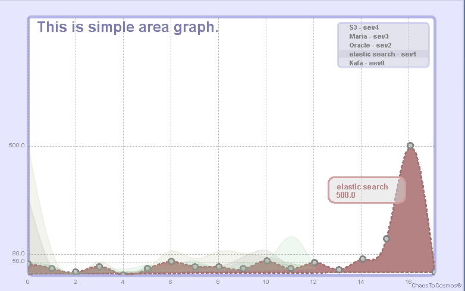
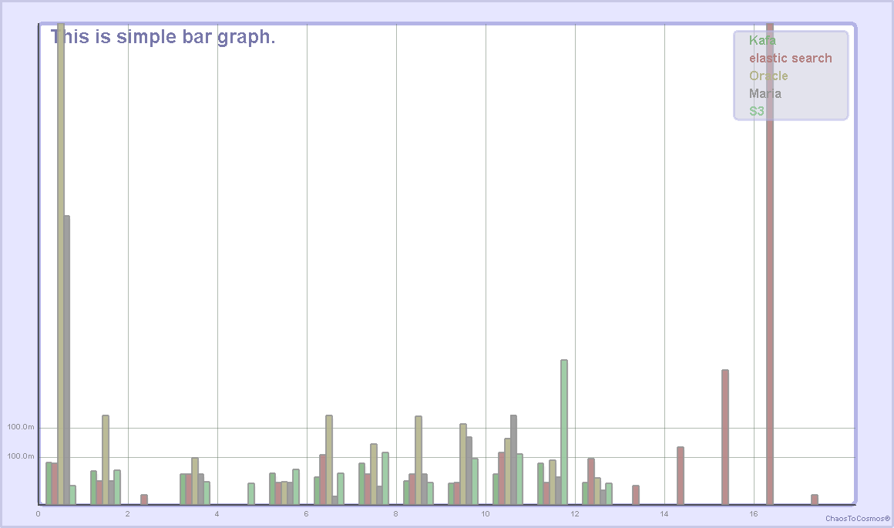
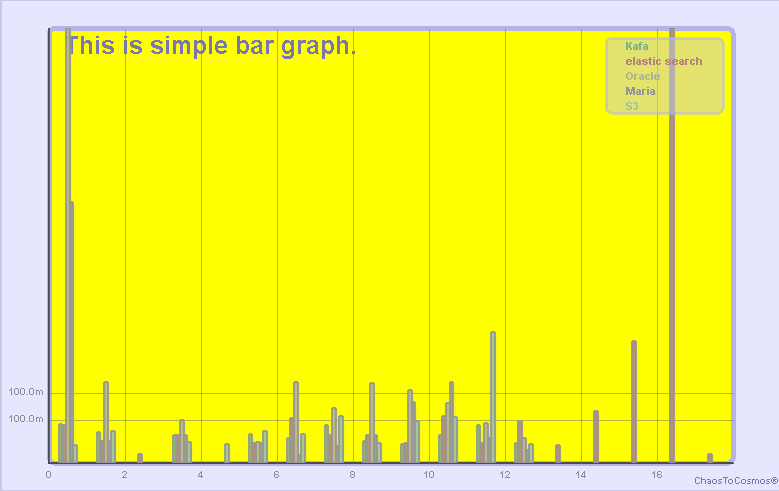
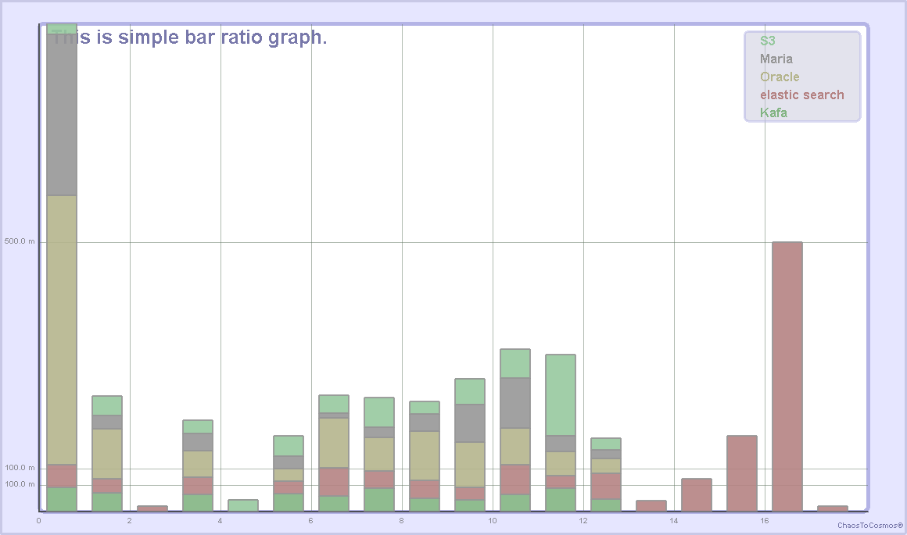

# 🌌 **ChaosGraph v2.0**  


---

## 📖 **Introduction**  
ChaosGraph is a library designed to create stunning and interactive charts on **AWT**, **Swing**, and **SWT** components.  
It is perfect for building desktop applications, Eclipse-based tools, or even RAP dashboard web applications.  
With ChaosGraph, you can deliver an exceptional user experience with interactive and visually appealing charts.

---

## 🎯 **What Can You Build with ChaosGraph?**  
- **Pure Java GUI Applications**: Create chart-based applications using AWT/Swing.  
- **Non-Web Dashboards**: Build dashboards for Java desktop applications.  
- **Eclipse RCP Tools**: Develop analysis apps, CRM, or MIS tools with enhanced UX.  
- **Web-Based Charts**: Use Eclipse RAP to render charts in web browsers.  

For detailed usage, check out the **Wiki** section above.

---

## 📥 **Current Library Download**  
The latest version is **v2.0.0** (October 26, 2020).  
Download it from the **Releases** section on the right-hand side of this repository.

---

## 📦 **Maven Dependency**  
Add the following to your `pom.xml`:  
```xml
<dependency>
    <groupId>io.github.9ins</groupId>
    <artifactId>chaosgraph</artifactId>
    <version>2.0.0</version>
</dependency>
```

---

## 🛠️ **Gradle Dependency**  
Add this to your `build.gradle`:  
```groovy
implementation group: 'io.github.9ins', name: 'chaosgraph', version: '2.0.0'
```

---

## 🚀 **What's New and Improved in v2.0.0?**  

### ✨ **New Features**  
- **Bar Ratio Graph**: A new chart type for ratio-based visualizations.  
- **SWT Support**: Native widget rendering for SWT/Eclipse applications and RAP web apps.  
- **Interactive Popups**: Display data values in popups when selecting chart elements.  
- **Dynamic Resizing**: Resize charts and their elements proportionally using the mouse wheel.  
- **Event Listeners**: Add custom interactivity to charts.  
- **GraphPanel & GraphCanvas**: Dedicated components for AWT/Swing and SWT, respectively.  

### 🔧 **Improvements**  
- Enhanced object-oriented design for better usability and maintainability.  
- Improved graphical effects for a more polished appearance.  
- Optimized rendering structure for smoother performance.  
- Resizable chart elements to maintain proportionality.  

---

## 🧩 **Chart Object Structure**  


---

## 💻 **Example Snippets**  

### **AWTGraphSimple1.java**  
- **Description**: A chart viewer that allows users to select and render charts.  
- **Features**: Export charts to various image formats (PNG, JPG, TIFF, BMP).  
- **Location**: `src/main/java/org/chaostocosmos/chaosgraph/awt2d/AWTGraphSimple1.java`

---

### **AWTGraphSimple2.java**  
- **Description**: A JVM memory monitor that visualizes real-time memory usage with dynamic charts.  
- **Features**: Populate objects to observe memory changes dynamically.  
- **Location**: `src/main/java/org/chaostocosmos/chaosgraph/awt2d/AWTGraphSimple2.java`

---

### **SWTGraphSimple.java**  
- **Description**: A conversion of AWTGraphSimple1 for SWT applications.  
- **Location**: `src/main/java/org/chaostocosmos/chaosgraph/swt2d/SWTGraphSimple.java`

---

## 🖼️ **Gallery**  

### **Area Chart**  


---

### **Area Chart with Interpolation**  


---

### **Bar Chart**  


---

### **Bar Chart with Yellow Background**  


---

### **Bar Ratio Graph**  


---

### **Circle Graph**  


---

### **Line Graph**  


---

### **JVM Memory Viewer (Movie)**  
[JVM_Memory_Viewer.mp4](./docs/images/JVM_Memory_Viewer.mp4)

---

## 🤝 **Contributing**  
We welcome contributions!  
- **Found a bug or have a feature request?** Open an issue.  
- **Want to contribute?** Submit a pull request or apply via the **Issues** tab with the title "Contribution Application."  

---

## 📜 **License**  
ChaosGraph is licensed under the [Apache License 2.0](http://www.apache.org/licenses/LICENSE-2.0).  

---

## 📧 **Contact**  
Developed by **Kooin Shin**  
- **Email**: chaos930@gmail.com  
- **GitHub**: [@9ins](https://github.com/9ins)  

---

